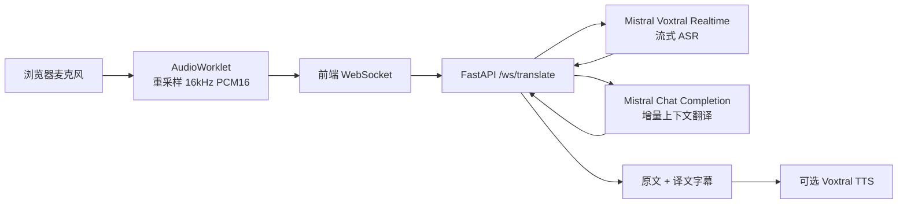

# Vox Bridge 实时语音翻译工具

Vox Bridge 是一个本地运行的 Web 实时语音翻译工具，前端通过麦克风采集音频，转成 16kHz mono PCM16 后走 WebSocket 发给后端；后端使用 Mistral Voxtral Realtime 做流式 ASR，再用 Mistral Chat Completion 做增量翻译，可选调用 Voxtral TTS 播放翻译语音。

## 项目结构

```text
vox_bridge/
├── backend/
│   ├── .env.example
│   ├── requirements.txt
│   └── app/
│       ├── __init__.py
│       ├── config.py
│       ├── languages.py
│       ├── main.py
│       ├── schemas.py
│       ├── translator.py
│       ├── tts.py
│       └── voxtral_realtime.py
├── frontend/
│   ├── .env.example
│   ├── index.html
│   ├── package.json
│   ├── tsconfig.json
│   ├── tsconfig.node.json
│   ├── vite.config.ts
│   ├── public/
│   │   └── audio-processor.js
│   └── src/
│       ├── api.ts
│       ├── App.tsx
│       ├── audio.ts
│       ├── main.tsx
│       ├── styles.css
│       └── types.ts
└── README.md
```

## 架构说明



## 如何运行

### 1. 首次安装依赖

```bash
cd backend
python -m venv .venv
source .venv/bin/activate
pip install -r requirements.txt
cp .env.example .env
```

编辑 `backend/.env`，填入：

```bash
MISTRAL_API_KEY=your-real-mistral-api-key
```

安装前端依赖：

```bash
cd frontend
npm install
cp .env.example .env
```

### 2. 一条命令启动前后端

在项目根目录运行：

```bash
npm run dev
```

浏览器打开：

```text
http://127.0.0.1:5173
```

点击“开始”，允许麦克风权限，即可看到上方原文和下方翻译字幕。

## 支持语言

当前 UI 内置：

- 中 → 日
- 日 → 中
- 英 → 日
- 日 → 英

后端 schema 已把语言代码集中在 `backend/app/schemas.py`，需要扩展语言时增加 `LanguageCode` 和 `backend/app/languages.py` 的显示名即可。

## 低延迟策略

- 前端每约 100ms 发送一个 16kHz PCM16 音频 chunk。
- 后端把音频 chunk 放入异步队列，直接喂给 Voxtral Realtime 的 `transcribe_stream`，不在本地缓存整句。
- 后端监听 `TranscriptionStreamTextDelta`，收到增量转写就触发翻译。
- 翻译请求会携带最近若干条最终字幕上下文，并取消过期的增量翻译，避免字幕落后太多。
- VAD 只用于最终片段确认；实时字幕不依赖完整句子结束。

## 可优化点

- 延迟：把前端 `frameSize` 从 1600 调到 800，可把发送间隔从约 100ms 降到约 50ms，但 WebSocket 消息数和成本会增加。
- 稳定性：生产环境建议为 WebSocket 增加会话 ID、重连、心跳超时和服务端限流。
- 翻译质量：可把会议主题、术语表、说话人角色放进 `TranslationContext.build_prompt`。
- 成本：增量翻译现在会取消过期请求，但高频 ASR delta 仍会增加请求量；可增加 200-400ms debounce 或改成单个 Realtime speech-to-speech 会话。
- TTS：当前 TTS 在最终译文完成后生成 MP3；若要更低延迟，可改用 Voxtral TTS 的 `pcm` 流式格式。
- 部署：浏览器麦克风在非 localhost 场景需要 HTTPS；生产建议通过 Nginx/Caddy 统一代理前后端。
